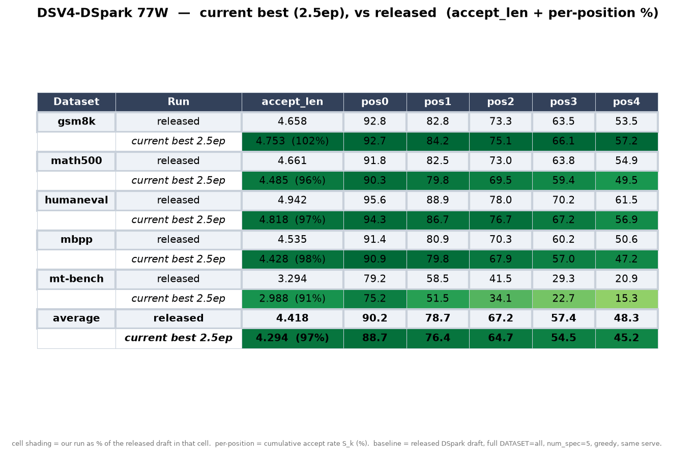

# DeepSeek-V4-Flash DSpark 投机解码草稿 —— 昇腾 NPU 技术报告

> **范围**:本报告只写**已完成并经过验证**的工作,截至 2026-08-11 的 5-epoch 训练收官。
> 规划性内容(自适应投机等)不在本报告内。
> **一手数据出处**:全部结论可在
> [评测账本](./ascend-npu-dsv4-dspark-eval-results.md)(逐次评测,append-only)和
> [工作日志](./ascend-npu-dsv4-worklog.md)(逐日流水,含所有弯路)中核对。
> **复现入口**:[流水线索引](./ascend-npu-dsv4-dspark-pipeline.md) 开头的六步最短路径。

---

## 一、结论

在昇腾 NPU 上**从零训练**出的 DeepSeek-V4-Flash DSpark 草稿模型,在同一套服务栈、同一批评测集上:

| | 我们(5 epoch) | DeepSeek 官方发布草稿 | 比值 |
|---|---:|---:|---:|
| gsm8k | **4.849** | 4.658 | **104.1%** |
| math500 | 4.565 | 4.661 | 97.9% |
| humaneval | 4.933 | 4.942 | 99.8% |
| mbpp | **4.555** | 4.535 | **100.4%** |
| mt-bench | 3.079 | 3.294 | 93.5% |
| **五项平均** | **4.396** | 4.418 | **99.5%** |
| **非聊天四项平均** | **4.726** | 4.699 | **100.6%** |

- **非聊天任务上已经超过官方发布的草稿**;gsm8k 与 mbpp 单项超过。
- **端到端加速比 1.39×**(1.18–1.64×,vs 无投机自回归,同服务、并发 48)。这是**吞吐受限区间的保守下界**。
- 唯一的缺口是 **mt-bench(93.5%)**,即多轮对话。归因明确:训练用的 rollout 数据 **99.96% 是单轮**,是**数据分布问题**,不是模型缺陷。

配置:3 层 × [MLA + 每头 attention sink + 256 路由/1 共享 MoE + 流形约束超连接] + Markov 头 + confidence 头;`block_size=5`,取 target 第 [40,41,42] 层的隐藏状态;8×Atlas A2,EP8 + FSDP2,124,480 步(5 epoch),数据集 77 万条去重 rollout。

---

## 二、背景与目标

投机解码用一个小"草稿模型"一次提出若干 token,再由大模型(target/verifier)一次性验证,接受多少就跳过多少次前向。收益直接取决于**接受长度**(accept length)。

DeepSeek 为 V4-Flash 发布了配套的 DSpark 草稿,但:

1. **它只有权重,没有训练方案。** 换一个 target、换一批业务数据,就没有可复用的路径。
2. **昇腾侧没有可用的训练链路。** 草稿模型要吃 target 的中间层隐藏状态,这在昇腾的推理栈上不存在现成通路。

因此目标是:**在昇腾上建立一条可复现的、从零训练 DSV4-Flash DSpark 草稿的完整链路**,并以官方发布的草稿作为质量标尺 —— 达到同等水平即证明链路成立。

**为什么这个标尺是硬的**:我们在自己的服务栈上重新测了官方草稿(而不是引用它的公开数字),得到五项平均 **4.42**、gsm8k **4.658**。所有对比都在这条同栈基线上做,不存在跨栈口径问题。

---

## 三、技术方案

### 3.1 链路总览

```
[1] 环境      [2] 数据生成        [3] 服务              [4] 训练          [5] 评测
  两套 conda   target rollout     verifier + HS 转储     FSDP2 + EP8      接受长度
              (贪心 temp=0)      hs_<行号>.safetensors  DSpark 草稿      vs 官方草稿
                     │                    │                  ▲
                     └──── 行号 ──────────┴──── HS 文件 ─────┘
```

把整条链串起来的是一个约定:**rollout 的行号 = HS 文件名 = 训练样本键**。rollout 产出 Arrow 数据集(第 `i` 行 = 一条 prompt+response + `loss_mask`);服务端按每行的 `input_ids` 做 prefill,转储 `hs_<i>.safetensors`;训练器同时读 Arrow 第 `i` 行与 `hs_<i>`。

### 3.2 草稿模型:洁净室复现

草稿是 DSV4 自身架构的 3 层缩小版,不是 DFlash 的变体:

- **MLA**:q/o 双 LoRA 投影,每头 attention sink
- **MoE**:256 路由专家 + 1 共享专家,`sqrtsoftplus` 打分,`noaux_tc` top-k 选择
- **超连接(mHC)**:流形约束的多残差连接
- **DSpark 头**:Markov 转移头(低秩 V×r / r×V 偏置)+ confidence 头

**逐组件对齐 `transformers` 的 `deepseek_v4`**:RMSNorm 与超连接块**逐位相等**,MoE ~1.5e-7,attention sink ~1.2e-7(`dsv4_dspark_hf_parity.py`);路由与 rotary 约定另与 torchtitan 的 DeepSeek-V4 交叉核对。

### 3.3 专家并行训练

256 个专家全量放不进单卡,而**逐专家 FSDP 分片与融合 grouped-GEMM 不兼容**(grouped 要求每个专家的权重完整且本地)。

方案(对齐 torchtitan 的 EP):

- 路由专家做成**堆叠权重**的 `GroupedExperts`(`w1/w3 [E,inter,dim]`、`w2 [E,dim,inter]`),不是 `ModuleList`
- 每卡只建自己的 `[E/EP, ...]` 切片,包成 **`Shard(0)` DTensor**,与 FSDP 分片的其余参数**同处一个 DeviceMesh**
- 前向:`.to_local()` 取本地专家 + **带自动微分的 all-to-all** 把 token 送到属主卡 → 本地 grouped-GEMM → all-to-all 送回

**关键取舍**:`Shard(0)` 包装不是为了分片(专家由 `ignored_params` 排除在 FSDP 之外),而是为了让**所有参数都是同构 DTensor**,这样优化器 / 梯度裁剪 / DCP 存档**不需要区分两类参数**。第一版曾让专家保持普通 tensor 并排除出 FSDP,结果 `clip_grad_norm_` 崩、AdamW `_foreach_mul_` 崩、存档崩,变成打补丁的打地鼠且不可上游 —— 该版本已整体回退。

设计细节见 [EP 训练文档](./ascend-npu-dsv4-dspark-ep-training.md)。

### 3.4 在线隐藏状态通路

训练需要 target 第 [40,41,42] 层的隐藏状态。全量物化整个数据集的 HS 在存储上不现实,因此采用**在线滚动缓冲**:一个普通的 bf16 服务进程带 `HS_DUMP=1` 边产边写,训练器边读边删(`--on-missing generate --on-generate delete`)。

### 3.5 转换与部署

训练产出的是洁净室命名空间(`layers.{n}.*`,专家堆叠);服务端加载的是官方的 `mtp.*` 布局(逐专家键)。转换脚本做纯改名 + 专家拆解,**无任何数值变换**,并由一个独立实现的反向映射校验器逐张量比对 —— **每个 checkpoint 都是 2378/2378 逐位相等**。

---

## 四、关键问题与根因

> 这一章是本报告的核心。结果可以照抄,**踩过的坑和定位方法不能**。
> 每条按「现象 → 误判 → 真因 → 验证」记录。

### 4.1 ★ 训练侧 RoPE 退化 —— 这是最大的那道坎

- **现象**:训练指标一路上涨,评测接受长度却在 ~3.5 卡住,且过 1.5ep 后**掉头下降**。典型的 `train↑ / eval↓` 背离。
- **误判**:先后归因为数据量不足、数据脏、需要 TTT/曝光偏差修正、KD 温度、学习率。全部做过,全部无效 —— 换数据清洗后 1.5ep 仍是 3.52,与不清洗持平。
- **真因**:草稿的 `freqs_cis` 是 **complex64**,而昇腾 aclnn 不支持复数,训练时把模型整体转 bf16 **丢掉了虚部**,于是 `apply_rotary_emb` 的「复数 × 实数」从**旋转**退化成了**纯缩放**;而推理侧是正常旋转的 —— 这就是 train↔serve 的不一致。
- **验证**:改成实数 cos/sin 交错(`feb0066` + `8db8f75`,与 vLLM-Ascend / MindSpeed / torchtitan-npu 一致)后做**单变量 A/B**:同配方、仅换 RoPE,0.5ep 从 3.56 → **3.84**,五个数据集**全部**上涨。且增益集中在**尾部**(gsm8k 逐位累计 pos2/3/4 从 59.8/46.3/35.0 → 65.6/53.6/42.8)—— 正是「后面的 block 槽位终于会旋转了」的signature。背离随之消失,评测开始跟随训练。

**教训**:`train↑ / eval↓` 背离要优先怀疑 **train↔serve 的实现不一致**,而不是数据或超参。前者是 bug,后者是调参 —— 我们在调参上花掉了数周。

### 4.2 `sample_from_anchor` 硬编码为 False

- **现象**:slot 0 的准确率恒为 0,整体接受长度上不去。
- **真因**:该开关被硬编码成 `False`,导致**目标错位一格**,且 **slot 0 从未被训练**。DSpark 的约定是所有 block 槽位都要预测(含 slot 0)。
- **验证**:改正后重训,slot 0 开始有信号,逐位准确率整体上移。

### 4.3 训练因果、服务非因果

- **现象**:训练收敛良好但服务端接受率异常低。
- **真因**:训练时草稿的滑动窗口注意力是**因果**的,而服务端的草稿是**非因果**地并行出 block 的。
- **验证**:训练加 `--sliding-window-non-causal` 与服务对齐后修复。

### 4.4 "双 norm teacher" 是对的 —— 改"正"反而更差

- **现象**:发现 teacher 分布经过了两次 norm,看起来像 bug。
- **误判**:当成 bug 修成单 norm。
- **真因**:双 norm 近似于 `w²` 的锐化,**更有利于蒸馏分布尾部**。改成单 norm 后**五个数据集全部回退**。
- **教训**:与参考实现不一致 ≠ 错误。改动前先做单变量 A/B。

### 4.5 MoE 专家坍缩与"过度均衡"

- **现象**:256 个专家在训练中收敛到少数几个被反复使用,大部分容量闲置。
- **处理**:开启 `noaux_tc` 负载均衡偏置(`DSPARK_MOE_BALANCE=1`,速率 `1e-3`),并**保持 router 随机初始化**(继承 verifier 的 router 会直接坍缩)。
- **反直觉的发现**:**强行把专家用满是有害的**。把有效专家数拉到 ~120 的那一版,五项平均只有 2.66。我们最终这一版稳定在**有效专家数 62–84 且热点在轮换**,与官方发布草稿的 47–70 轮换区间吻合。
- **判读要点**:单步的"有效专家数"低是**小 batch 假象**。必须同时看**热点专家集合的并集**:并集持续增长 = 不同输入用不同专家(健康),并集饱和 = 固定子集(真坍缩)。

### 4.6 损失归一化按每卡而非全局

- **现象**:无外部现象 —— 这是一个静默的目标函数偏差。
- **真因**:损失按**每张卡的**监督 token 数归一化;在 DDP/FSDP 对梯度取均值之后,实际优化的是**比值的平均** `(1/R)Σ(L_r/n_r)`,而不是 token 加权的 `ΣL_r/Σn_r`。打包采样器平衡的是**总** token 数,从不检查 `loss_mask`,所以不能避免这个问题。
- **验证**:实测 8 卡上的监督 token 分布 —— 最重/最轻卡累计比 **1.194**,各卡累计值**随卡序号单调递减**,且**不随步数衰减**(889/1745/2095 步分别为 1.185/1.190/1.194,零均值噪声应按 `1/√n` 缩小)。2095 步中有 **24 步某张卡的监督 token 数为 0**。
- **修正**:对(已 detach 的)分母做 all-reduce 取全局 token 数并乘以 world_size,使梯度平均后重建出 token 加权目标。**已提交上游 PR #942**,并做了同配方 A/B:0.5ep 五项平均 **3.8418 vs 3.8420**(Δ −0.0002),步时间变化 +20/+50/+40ms(不稳定,与整机漂移同量级)⟹ **采用正确目标函数不花代价**。

### 4.7 confidence 头训了但从未被使用

- **现象**:转换时报 `1 skipped: confidence_head.proj.bias`。
- **追查结论**(三条,均在源码层面核实):
  1. **服务端丢弃整个 confidence 头**,不只是 bias —— `deepseek_v4_draft.py` 的名称重映射对 `confidence_head.*` 直接返回 `None`。
  2. **训练侧它的输入是 detach 的**,梯度只更新该头自身两个张量,**无法到达骨干**。⟹ 对全部接受长度结果的影响**结构性为零**。
  3. **架构漂移**:我们的头带 bias,而 DSV4 发布的 `mtp.*` 布局没有。
- **修正**:改为配置项 `confidence_head_bias`,DSV4 默认 `False` —— 与上游 vLLM 的做法一致(其 DSV4 构造取默认 `False`,Qwen3-DSpark 显式传 `True`)。
- **意义**:当前固定长度投机下 confidence 不参与接受判定,所以无害;但它是**自适应草稿长度的前提**,该缺口需在那之前补齐。

---

## 五、结果

### 5.1 完整训练曲线

五数据集平均接受长度,每 0.5 epoch 一个点,全部经过转换 → 部署 → 全量评测:

| epoch | 0.5 | 1.0 | 1.5 | 2.0 | 2.5 | 3.0 | 3.5 | 4.0 | 4.5 | 5.0 |
|---|---|---|---|---|---|---|---|---|---|---|
| 平均接受长度 | 3.84 | 4.06 | 4.18 | 4.25 | 4.29 | 4.35 | 4.36 | 4.39 | 4.41 | **4.40** |
| 占官方草稿 (4.42) | 87.0% | 91.8% | 94.6% | 96.3% | 97.2% | 98.4% | 98.7% | 99.4% | 99.7% | **99.5%** |



### 5.2 收敛判据

不用单点的平均值判断收敛 —— **该指标的分辨率约 ±0.03**,而三个小数据集(humaneval 154 / mbpp 247 / mt-bench 70 样本)单步能跳 ±0.06,方向还会互相抵消。3.5ep 时我们据此误判过一次"已进入平台",4.0ep 就被推翻。

**正确的判据是看大样本集的增量序列**。gsm8k(1309 样本)每个 checkpoint 的增量:

```
+0.184 +0.135 +0.073 +0.052 +0.043 +0.026 +0.009 +0.009 +0.009
```

20 倍单调衰减,并在最后三个点稳定在 **+0.009**。同时最后三个 checkpoint 的五项平均跨度只有 **0.0138** —— 统计上是同一个点。学习率按余弦退火在第 5 epoch 精确归零,退火完成。

⟹ **交付点选 5.0ep 而非平均值略高的 4.5ep**(高 0.011,在抖动内):5.0ep 是排程终点(lr=0),且**最大样本的 gsm8k 在它上面取到全程最高值 4.849**。

### 5.3 逐位条件接受率

gsm8k 上每个 block 槽位「给定前缀已接受、该位再被接受」的概率:

| | pos0 | pos1 | pos2 | pos3 | pos4 |
|---|---|---|---|---|---|
| 我们 5.0ep | **0.937** | **0.915** | **0.900** | **0.889** | **0.878** |
| 官方草稿 | 0.928 | 0.892 | 0.885 | 0.868 | 0.842 |

**五个位置全部高于官方**,且优势随位置增大(pos4 领先 3.6 个百分点)—— 说明逐位机制本身已不是瓶颈。

### 5.4 端到端加速比

对照同栈的**无投机自回归**基线(并发 48,全量数据集,贪心):

| 数据集 | 无投机 tok/s | 投机 tok/s | 加速比 | 每 token 耗时 |
|---|---:|---:|---:|---|
| gsm8k | 460.7 | 605.1 | **1.31×** | 102.6 → 79.7 ms |
| math500 | 612.3 | 843.4 | **1.38×** | 66.8 → 52.4 ms |
| humaneval | 320.9 | 526.7 | **1.64×** | 103.2 → 73.6 ms |
| mbpp | 669.0 | 977.4 | **1.46×** | 61.5 → 44.1 ms |
| mt-bench | 446.8 | 526.5 | **1.18×** | 114.3 → 99.9 ms |
| **平均** | | | **1.39×** | |

吞吐比、墙钟比、端到端时延比三种独立算法互相吻合到 ~1%。

**测量方法上的两个坑**(都踩过):

- **TTFT 在这个对比里不能当有效性检查**。投机下 TTFT 高 1.5–2.4×,那是**排队**:每个引擎步多算一次草稿前向 + 6 token 验证,请求被调度得更慢。它是加速的代价,不是加速的反证。
- **`ITL` 跨 arm 不可比**。投机是成串吐 token 的,它的 ITL 是**块之间**的间隔。
- **正确的有效性检查是总输出 token 数**(贪心 + 相同 prompt ⟹ 等量的活):实测五个集在 ±2.2% 内。

⚠️ 顺带的观察:理论上贪心 + **无损**投机解码应逐 token 完全一致,总数应分毫不差;实测差 0.4–2.2%,说明我们这套**实践中不是逐位无损**(最可能是 target 前向的 batch 相关数值差异)。这不构成缺陷判定,但"与自回归逐 token 一致"这件事**我们从未验证过**。

### 5.5 训练成本

- **124,480 步 = 5 epoch**,8×Atlas A2(EP8),实测 **3.17 s/step** 端到端,约 4.5 天
- ⚠️ 日志里的 `profile/step_ms ≈ 1.98 s` **偏乐观约 60%**:差额是步计时之外的时间(等 HS 服务出数、dataloader 停顿、存盘)。**估算工期用实测值,不要用 `step_ms`**
- 显存:保留 55 GB / 分配 45 GB(64 GB 卡的 86%)

---

## 六、可复现性

完整六步命令见 [流水线索引](./ascend-npu-dsv4-dspark-pipeline.md) 开头。**五个不看就会白跑一轮的点**:

1. **`INIT_LAYER=1 INIT_MOE_NO_ROUTER=1`** —— 从 verifier 的 [40,41,42] 层热启动整层,但 **router 必须保持随机**
2. **A2(64GB)必须 `BF16_EXPERTS=1`** —— 否则 EP 下自动选 fp32 专家,第一次反向就 OOM
3. **`MAX_ANCHORS=512` 时 `RECOMPUTE=1` 强制** —— 否则 tv-loss 的 softmax 里 OOM
4. **中期存档会被 epoch 末存档覆盖**(同一个整数目录),0.5/1.5ep 的权重要立刻转换
5. **`--hidden-states-path` 必须等于服务端的 `DSPARK_HS_DIR`**;换数据集必须先清空 HS 目录 —— HS 文件按 Arrow 行号索引,重新索引过的数据集会**静默配错样本**

**预期轨迹**(用来判断自己的 run 是否正常):`0.5ep 3.84 → 1.0 4.06 → … → 5.0 4.40`。

**转换必须校验**:`verify_dspark_conversion.py` 应输出 **2378/2378 bit-exact**。

---

## 七、上游贡献

### PR #942 —— 全局(跨卡)损失归一化

修正 §4.6 的目标函数偏差。当前状态:CI 全绿,`mergeable`,等待 approved-reviewer 审批。

已按 reviewer 要求补齐两项实验(见 §4.6):运行时无可测开销;0.5ep 同配方 A/B 精度无回归;并附上真机实测的每卡不均衡度作为该修正的前提证据。

评审中另指出 DSpark 的 confidence BCE 项仍为逐卡归一化、与主损失不一致 —— 已抽出共享 helper 两处统一,并补了对应的 2 卡测试。

### RFC #952 —— DeepSeek-V4-Flash 原生支持

向 vllm-project/speculators 提出将本工作上游化,并给出**按通用性排序的分批合入建议**:

1. FSDP2 上的专家并行 MoE 训练(与模型无关)
2. `--init-*-from-target` 热启动开关
3. MoE 草稿 router 的 `noaux_tc` 负载均衡
4. DSV4 原生草稿模型

同时说明了厂商相关代码的边界:草稿模型本体是可移植 PyTorch,`torch_npu` 只出现在两个吞吐优化模块中且调用点全部按设备类型门控,可从首个上游 PR 中剥离。

---

## 八、未尽事项

按可行动性排序:

1. **mt-bench 缺口(93.5%)** —— 唯一剩下的实质差距,归因于 rollout 数据 99.96% 单轮。**对策明确**:补多轮对话 rollout 后重训。这是把五项平均推过 100% 的最直接杠杆。
2. **低并发加速比** —— 现有 1.39× 是并发 48(吞吐受限)下的**下界**。并发 1 才是"加速比"这个词的本义,需要两个 arm 各跑一次。
3. **验证逐 token 无损** —— 见 §5.4,贪心下与自回归的输出一致性从未验证。做法很便宜:同 prompt、贪心、直接 diff 输出。
4. **confidence 头接入服务** —— 见 §4.7。当前无害,但它是自适应草稿长度的前提。
5. **fp8→bf16 反量化脚本泛化** —— 现有实现针对草稿张量,推广到整模型即可摆脱对外部工具链的依赖。

---

## 附:相关文档

| 文档 | 内容 |
|---|---|
| [流水线索引](./ascend-npu-dsv4-dspark-pipeline.md) | **复现入口**,六步最短路径 + 各阶段索引 |
| [评测账本](./ascend-npu-dsv4-dspark-eval-results.md) | append-only,每次评测的逐数据集 / 逐位置明细 |
| [工作日志](./ascend-npu-dsv4-worklog.md) | 逐日流水,含所有弯路、撤回与判断依据 |
| [EP 训练文档](./ascend-npu-dsv4-dspark-ep-training.md) | 专家并行的设计取舍与验证矩阵 |
| [架构规格](./ascend-npu-dsv4-dspark-training-port.md) | 洁净室草稿模型的逐组件规格 |
| [接受率排查树](./ascend-npu-dsv4-dspark-acceptance-troubleshooting.md) | 接受长度偏低时的定位顺序 |
